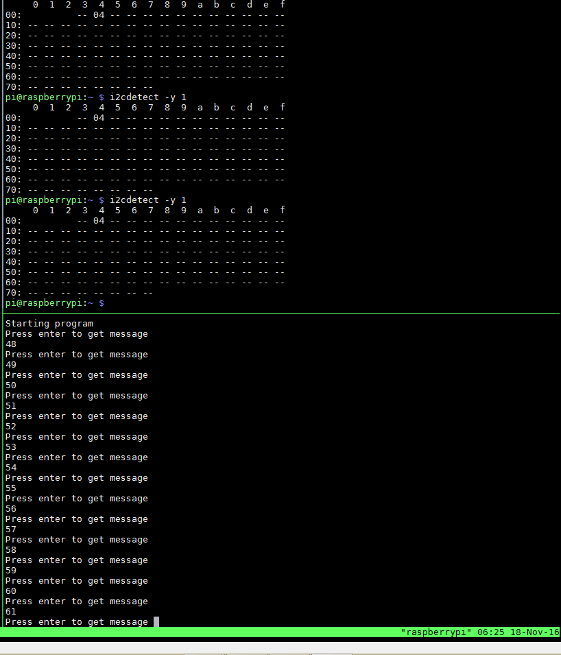

#i2cCountExample

Turns the arduino into a simple i2c slave device.



## Required libraries

On the python side (in our case the rasperry pi) we need to download some tools so we can interface with the i2c bus.

``` bash
sudo apt-get install i2c-tools
sudo apt-get install python-smbus
```

## Arduino

The arduino code simply adds an `onRequest` handler when a message is sent to this (arduino) device. In the example it is hardcoded to `0x04` but can be changed to any available i2c address (see Tools and tips to find out what i2c addresses are available).

## Python

The python code connects to the arduino using the i2cbus with the `smbus` library. In the main loop, when the user presses `enter` the pi sends a request for 1 byte. If there is an error, a flag is set which is used for re-attempts for communication. 

## Tools and Tips

Running the following:

``` bash
i2cdetect -y 1
```

probes the i2c-1 bus on the raspberry pi and prints out table of all the connected i2c devices.

