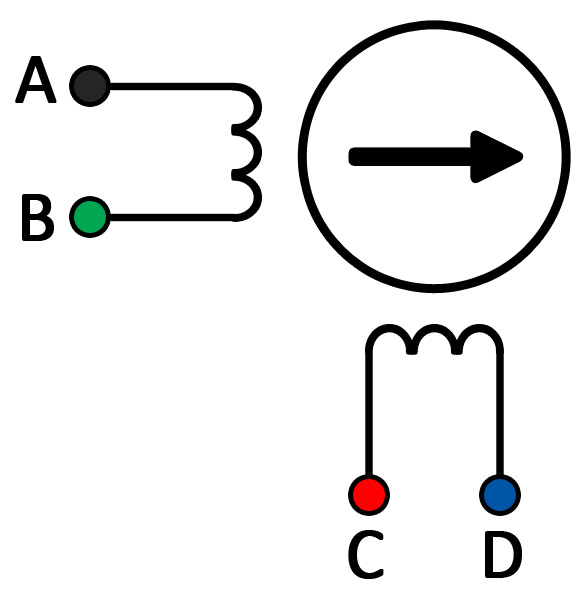
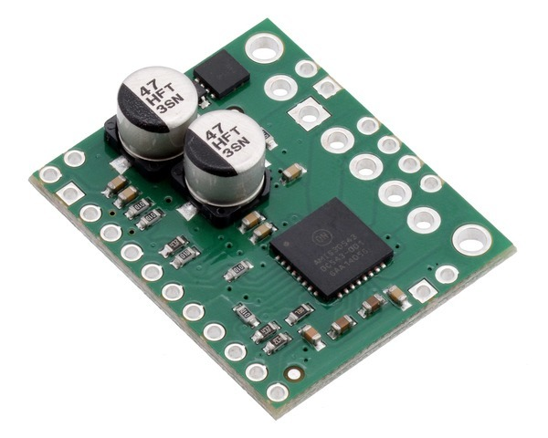
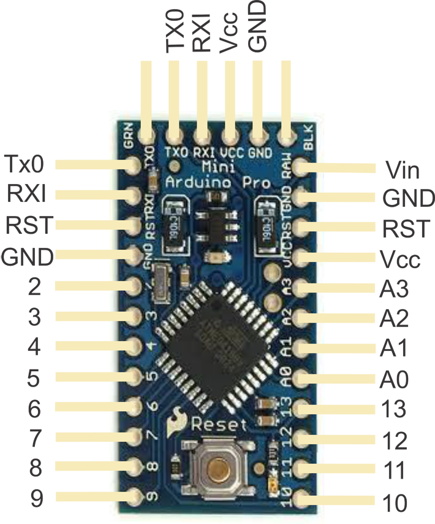

# AMIS30543 Stepper Motor Test

Runs the stepper motor straight from the arduino and a power supply. The product page for the AMIS can be found here: https://www.pololu.com/product/2970

## Stepper Controller and motor




The stepper controller excites the two coils in the motor thereby "stepping" by a certain number of degrees (denoted by the motor itself and it's gearing). Using the diagram above, the following wires were connected:

| Stepper Controller | Stepper Motor |
| ------------------ | ------------- |
| MOTXP              | A             |
| MOTXN              | B             |
| MOTYP              | C             |
| MOTYN              | D             |

(note, DC+ and DC- are connected to the battery driving the stepper motors)

## Arduino control



| Stepper Controller | Arduino       |
| ------------------ | ------------- |
| GND		         | GND           |
| NXT (STP)          | Pin 3         |
| DIR                | Pin 2         |
| DI (MOSI)	         | Pin 11        |
| CLK (SCK)          | Pin 13        |
| CS                 | Pin 4         |

The stepper motor controller uses 2 control signals for operation. The NXT (STP) pin recieves pulses denoting the number of steps in the direction of DIR (0 for CW and 1 for CCW). The Stepper motor controller must be connected to the microconteroller over the SPI bus and be enabled in order for it to operate. The example code sets up the stepper motor controller and runs the motor forward and back in a loop. In the setup phase, the controller's max current setting, step mode (e.g. microstepping), and enable/disable modes are set. 

## Setup Code

``` C++
AMIS30543 stepper;

void setup(){
  SPI.begin();
  stepper.init(amisSlaveSelect);

  // Drive the NXT/STEP and DIR pins low initially.
  digitalWrite(amisStepPin, LOW);
  pinMode(amisStepPin, OUTPUT);
  digitalWrite(amisDirPin, LOW);
  pinMode(amisDirPin, OUTPUT);

  delay(1);                  // Give the driver some time to power up.
  stepper.resetSettings();   // Reset the driver to its default settings.

  // Set the current limit.  You should change the number here to
  // an appropriate value for your particular system.
  stepper.setCurrentMilliamps(1800);  
  
  stepper.setStepMode(1);   // Set the number of microsteps that correspond to one full step.
  stepper.enableDriver();   // Enable the motor outputs.
}
```


## Looping Code

``` C++
void loop(){
  // Step in the default direction 1000 times.
  setDirection(0);
  for (unsigned int x = 0; x < 1000; x++){
    step();
  }
  
  delay(300);   // Wait for 300 ms.

  // Step in the other direction 1000 times.
  setDirection(1);
  for (unsigned int x = 0; x < 1000; x++){
    step();
  }
  
  delay(300);   // Wait for 300 ms.
}
```

## End Notes

- As per the documentation, the motor controller can run up to 1.7A without a heatsink and up to 3A with it
- In the `step` function, there is an extra delay after the pulse than can be adjusted to increase or decrease the speed of the stepping of the motor


