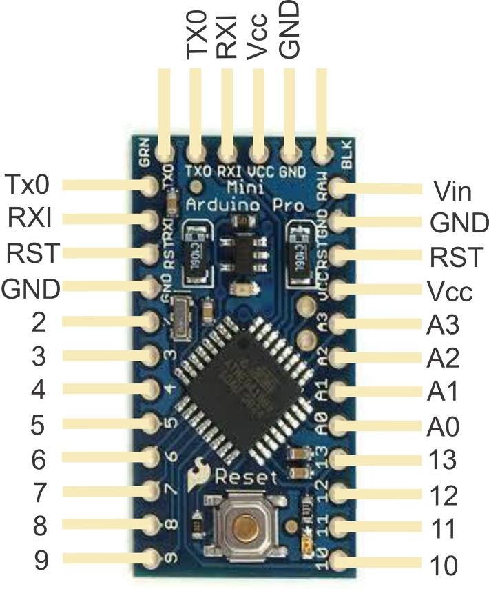

#stepperControl

Runs the stepper motor straight from the arduino and a power supply.

## Stepper Controller and motor


The stepper controller excites the two coils in the motor thereby "stepping" by a certain number of degrees (denoted by the motor itself and it's gearing). Using the diagram above, the following wires were connected:

| Stepper Controller | Stepper Motor |
| ------------------ | ------------- |
| A+                 | A             |
| A-                 | B             |
| B+                 | C             |
| B-                 | D             |

(note, DC+ and DC- are connected to the battery driving the stepper motors)

## Arduino control



| Stepper Controller | Arduino       |
| ------------------ | ------------- |
| PUL+ (+5V)         | VCC           |
| PUL- (PUL)         | Pin 8         |
| DIR+ (+5V)         | VCC           |
| DIR- (DIR)         | Pin 9         |
| ENA+ (+5V)         | VCC           |
| ENA- (ENA)         | Pin 3         |

The stepper motor controller uses 3 control signals for operation. The enable pin (ENA) is set to `HIGH` to turn on the motor controller and excite the coils. The direction (DIR) pin designates the direction (either clockwise or counter-clockwise) depending on if this pin is set `HIGH` or `LOW` (note that the direction depends on the motor coil configuration, a quick test will show the default direction). Lastly, the pulse (PUL) pin is what tells the motor controller to 'step' the motor a single step (typically 1.8 or 0.9 degrees). 


``` C++
for(int i = 0; i < 50000; i++){
	digitalWrite(pulPin,HIGH);
	delayMicroseconds(50);
	digitalWrite(pulPin,LOW);
	delayMicroseconds(50);
}
```

In the example code, we oscillate the pulse pin a set number of times to run the motor. By varying the number of steps (e.g. the number of iterations in our for loop), we vary how far the motor runs. By varying the length of the pulses, we vary how fast the stepper motor turns.

## Tools and Tips

The stepper motor controller can take a minimum pulse length of 2.2 microseconds on and off. 