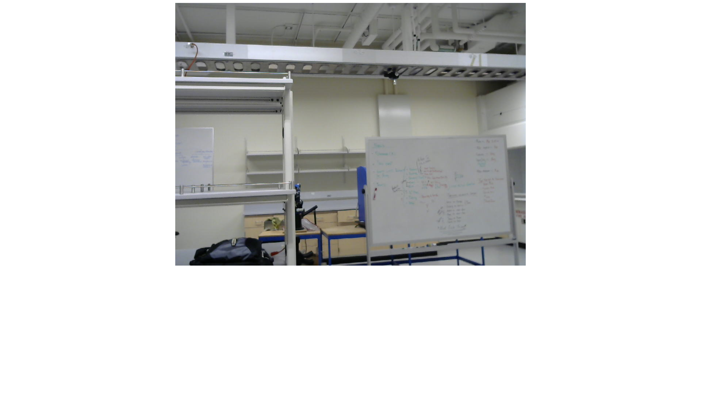

#mjpeg-streamer

mjpeg-streamer is a useful tool that we use to ouput the video from a camera connected to the main computing unit. 



## installation

In order to get mjpeg streamer working on our pi we need to install a few libraries.

```bash
sudo apt-get update
sudo apt-get install libv4l-dev libjpeg8-dev
sudo apt-get install imagemagick
sudo apt-get install subversion
```

After everything gets installed we need to get a copy of mjpg-streamer and apply a patch.

```bash
svn co https://svn.code.sf.net/p/mjpg-streamer/code/mjpg-streamer
cd mjpg-streamer
```

unfortunately, we also need to patch mjpg-streamer. Use the following:

```bash
wget https://raw.githubusercontent.com/penguindustin/ARI_2016_Documentation/development/mjpeg-streamer/input_uvc_patch.txt
patch -p0 < input_uvc_patch
make USE_LIBV4L2=true
```

After compiling we want to make it more easily accesible by moving the relevant shared object files and mjpg_streamer command to more friendly locations.

```bash
sudo cp mjpg_streamer /usr/local/bin
sudo cp output_http.so input_uvc.so /usr/local/lib/
sudo cp -R www /usr/local/www
```

## Usage

On the MCU (in our case it was the raspberry pi), run the follwing command

```bash
mjpg_streamer -i "/usr/local/lib/input_uvc.so -d /dev/video0 -f 30 -r 960x720 " -o "/usr/local/lib/output_http.so -p 8080 -w /usr/local/www"
```

On a computer connected to the same network, open up `webpageStreaming.html` in a browser window.

```html

```

(Note: make sure that the ip address is the same as the MCU)

