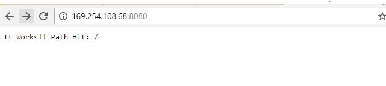
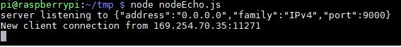
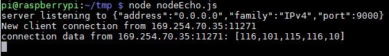
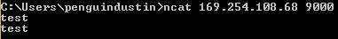

# Node js

Nodejs allows us to quickly set up a server listening on a specific port without having to deal with all the nitty gritty of network programming. This tutorial runs along with an instance of openframeworks to connect to the node server but we can simulate this with other tools like netcat.

img of it running goes here

## Connecting to raspberry pi

### Method 1, direct connect using ethernet cable

The raspberry pi has built in technology to detect weather a crossover cable (a special type of ethernet cable) is connected or not and switch it's pins accordingly if one isn't connected. What this means is that we can simply hookup any ethernet cable to the pi and it will configure itself correctly to work. The default way we can connect to it is with the following:

```bash
ssh pi@raspberrypi.local
```

##Installing Nodejs

The first thing we need to check is what version of nodejs we have installed. Raspbian (one of the default options for os on the raspberry pi) comes with a pretty old version node. We can check this using:

```bash
pi@raspberrypi node -v
v0.10.29
```

In this case, the packaged version of nodejs is `v0.10.29`. We want to upgrade this to something newer and stable. First let's uninstall the old version and associated node stuff with:

```bash
sudo apt-get remove 
```

[] TODO: figure out if we have to update nodejs or not

### Sample program

In a temporary directory, create a file named `myServer.js` and put the following:

```js
var http = require('http');
const PORT=8080; 

function handleRequest(request, response){
    response.end('It Works!! Path Hit: ' + request.url);
}

var server = http.createServer(handleRequest);

server.listen(PORT, function(){
    //Callback triggered when server is successfully listening. Hurray!
    console.log("Server listening on: http://localhost:%s", PORT);
});
```

now start the server with

```bash
node myServer.js
```

and then in a browser go to the ip address of your pi (you can find this using `ifconfig` and looking at what the `inet addr` is for `eth0`) . You should get something like looks like this:



For more info on how to use nodejs look [here](http://blog.modulus.io/build-your-first-http-server-in-nodejs) and [here](http://nodeguide.com/beginner.html).

## TCP

http has a lot of overhead so instead of simply creating an http server, we're going to reduce this by using a TCP server. Some helpful info on how to do this is [here](http://blog.yld.io/2016/02/23/building-a-tcp-service-using-node-js/#.V_5vaPkrJhE) and [here](http://www.hacksparrow.com/tcp-socket-programming-in-node-js.html).

The sample code below (described in detail in one of the tutorials described above) will echo any TCP message sent to it. To install, create a file called `nodeEcho.js` and put the following code:

```js
//Credit goes to Pedro Teixeira for this example code 
//See http://blog.yld.io/2016/02/23/building-a-tcp-service-using-node-js/#.V_7nM_krJhF
var net = require('net');

var server = net.createServer();  
server.on('connection', handleConnection);

server.listen(9000, function() {  
  console.log('server listening to %j', server.address());
});

function handleConnection(conn) {  
  var remoteAddress = conn.remoteAddress + ':' + conn.remotePort;
  console.log('new client connection from %s', remoteAddress);

  conn.on('data', onConnData);
  conn.once('close', onConnClose);
  conn.on('error', onConnError);

  function onConnData(d) {
    console.log('connection data from %s: %j', remoteAddress, d);
    conn.write(d);
  }

  function onConnClose() {
    console.log('connection from %s closed', remoteAddress);
  }

  function onConnError(err) {
    console.log('Connection %s error: %s', remoteAddress, err.message);
  }
}
```

and run it with:

```bash
node recFromOther.js
```

Then we can use netcat (part of the nmap network tools suite, in my case I installed it using the windows setup executable found [here](https://nmap.org/download.html)) and send messages using:

```bash
ncat 169.254.108.68 9000
```

You should see that we have a connection now between the client and server from the output log of the server.



Now if we type something into our terminal and hit `enter`, we get an echo back of what we sent! We can also see that the server has properly recieved the data as well.



