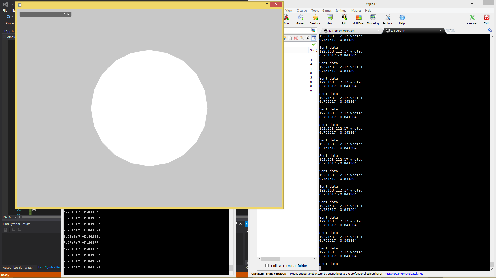

# ControllerToRoverCommunication

This is an example of sending controller commands to the rover computer.



## Installation
Simply create a new project and replace the src code with the srcs provided. (Note that when you are creating the project you must add the ofxNetwork addon)

## Usage

First, run the python server on the rover. Then, run the client project. After a TCP connection is established between the client and server, the server should be outputting:

```bash
Sent data
192.168.112.17 wrote:
0.000000 0.000000

Sent data
192.168.112.17 wrote:
0.000000 0.000000

.
.
.
```

over and over. The server is echoing back anything that is sent to it. Since the joysticks aren't moved, it is sending `0.000000 0.000000`. Moving the joysticks in the Y-axis, changes these values between -1 and 1 (as shown in the title card).

