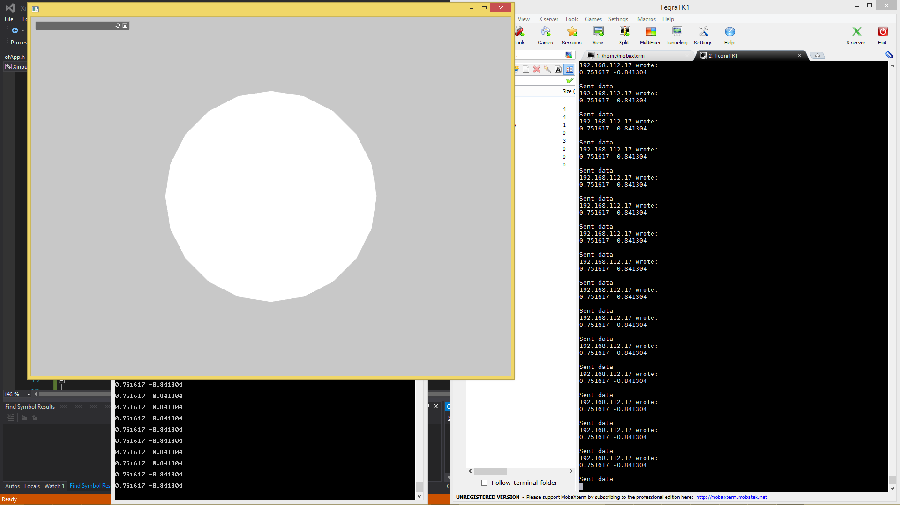

# GroundStationToArduino

This is an example of sending controller commands over ethernet to the rover computer to the arduino over I2C.

- [ ] TODO - change this photo


## TODO List


- [ ] Disconnect/reconnect procedure (HIGH IMPORTANCE)
- [ ] Create setup documentation
- [ ] Explain wiring (or link to wiring)
- [ ] Explain motor timing


## Installation
Simply create a new project and replace the src code with the srcs provided. (Note that when you are creating the project you must add the ofxNetwork addon)

## Usage

To run the system we first have to start the appropriate server on the TK1 and then start the client program on the ground station.

1 - Run Controller2JoyTest.py
=============================

On the TK1 run the following:

```bash
sudo python Controller2JoyTest.py
```

This should start a server that waits for TCP messages from the ground station with input from the gamepad.

2 - Run the Ground Station Client
=================================

On the ground station, run the openframeworks program that implements the TwoJoystickTest source code.

## Code Notes

- [ ] TODO - insert values read and conversions (e.g. -1 to 1 to 0 to 255 etc.)

