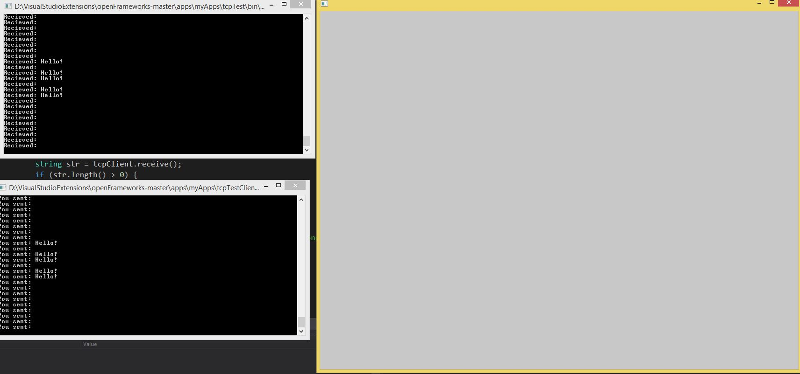

# TCPCommunication
This is an example of how to do simple TCP communication using openframeworks.



(Note, the top left is the server, the bottom left is the client, and the large window on the right is the application window for the client program)

## Installation
Simply create 2 new projects and replace the src code with the two srcs provided. (Note that when you are creating the project you must add the ofxNetwork addon)

## Usage

First, run the server project. Then, run the client project. After a TCP connection is established between the client and server, the server should be outputting:

```bash
Recieved: 
Recieved:
Recieved:
```

over and over. The server is echoing back anything that is sent to it. Since we aren't sending anything to the server this makes sense.

Now, going back to the client, make sure the client is in focus (e.g. click on the client application window). Pressing enter will send "Hello" to the server over TCP like so:

```bash
Recieved: Hello
Recieved: Hello
Recieved: Hello
```

## Explanation

Now that we know how the code works, let's go into detail how it's done.

### Server

In `ofApp.h` we have to tell the program that we want to create a server. To do this we have to make sure to include the `ofxTCPServer.h` is included at the top of the file. Then, we define the server itself in the body of the ofApp class with:

```bash
ofxTCPServer TCP;
```

Now that we've defined our server, we have to set it up. In `ofApp::setup()` we have to define the port we are listening on using 

```bash
ofxTCPSettings settings(11999);
TCP.setup(settings);
TCP.setMessageDelimiter("\n");
```
where 11999 is the port we are listening to. After we create the settings we apply them using `TCP.setup(settings)`. Another important thing to note is that we set the message delimiter. This must be the same for the client in order for this to work properly.

Looking at the main body of the server we can see how it works.

```C++
void ofApp::update(){
	uint64_t now = ofGetElapsedTimeMillis();
	if (now - lastSent >= 100) {
		for (int i = 0; i < TCP.getLastID(); i++) {
			if (!TCP.isClientConnected(i)) continue;
			//TCP.send(i, "hello client - you are connected on port - " + ofToString(TCP.getClientPort(i)));
			string str = TCP.receive(i);
			std::cout << "Recieved: " << str << "\n";
			TCP.send(i, "You sent: " + str);
		}
		lastSent = now;
	}
}
```
First we check the time with `ofGetElapsedTimeMillis()` and compare that with the current time `now` (this should also be setup in the header file). If the time since the last sent message was greater than .1 seconds, then we read from all the TCP connections (in our case there is only 1) using the line `for(int i = 0; i < TCP.getLastID(); i++)`. We check if the client is connected to us over our specfic port using:

```C++
if (!TCP.isClientConnected(i)) continue;
```
If the client isn't connected, we skip that TCP connection and continue to check the next one. The next few lines are pretty self descriptive. The server reads the TCP message to a string with `TCP.recieve(i);` The server then finally echos the message into the console with `std::cout << "Recieved: " << str << "\n";`. Then, for the bow on top, the server sends back the message to the client with `TCP.send(i, "You sent: " + str);`.

### Client

The client code is similarly structured. In `ofApp.h` the `ofxTCPClient.h` has to be included. Then, like how we instantiated a server, we instantiate a client using the following:

```C++
ofxTCPClient tcpClient;
```

To create a TCP connection you have to define some settings using `ofxTCPSettings`. Unlike in the server's case, we have to provide the ip address of the server we want to connect to along with the port. In this examples case:

```C+++
ofxTCPSettings settings("127.0.0.1", 11999);
tcpClient.setup(settings);
tcpClient.setMessageDelimiter("\n");
```

The ip adress is 127.0.0.1 (localhost) and the port is the same before we stated in the server (note these must be the same to work). We apply these settings to our client using `tcpClient.setup(settings);` Also note that we have to set the message delimiter (Important note, the delimiter must be the same as stated in the server).

#### Recieving from server

Now getting to the meat of the code, the first thing we check is if we are connected to the server. `if (tcpClient.isConnected())` if this statement is true, we echo out the response from the server (so long as the response isn't nothing) to the console. This is done in the following:

```C++
string str = tcpClient.receive();
if (str.length() > 0) {
	msgRx = str;
	std::cout << str << std::endl;
}
```
If we aren't connected to the server, we attempt to retry connecting  every 5 seconds (note, deltaTime and connectTime should be defined in the header)

```C++
msgTx = "";
deltaTime = ofGetElapsedTimeMillis() - connectTime;

if (deltaTime > 5000) {
	tcpClient.setup("127.0.0.1", 11999);
	connectTime = ofGetElapsedTimeMillis();
}
```

####

The last part of our client code simply sends "Hello!" to the server if the user presses enter. This is done with the following:

```C++
void ofApp::keyPressed(int key){
	if (tcpClient.isConnected()) {
		if (key == OF_KEY_RETURN) {
			msgTx = "Hello!";
			tcpClient.send(msgTx);
		}
	}
}
```