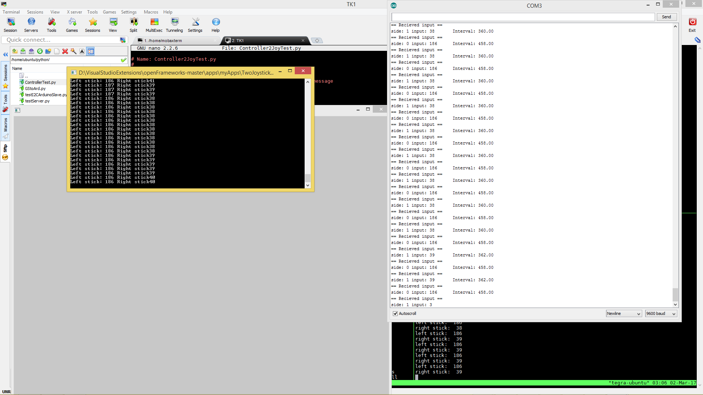

# GroundStationToArduino

This is an example of sending controller commands over ethernet to the rover computer to the arduino over I2C.

- [ ] TODO - change this photo

## TODO List

- [ ] Disconnect/reconnect procedure (HIGH IMPORTANCE)
- [ ] Create setup documentation
- [ ] Explain wiring (or link to wiring)
- [ ] Explain motor timing

## Installation
Simply create a new project and replace the src code with the srcs provided. (Note that when you are creating the project you must add the ofxNetwork addon)

## Usage

First, run the python server on the rover. Then, run the client project. After a TCP connection is established between the client and server, the client should be sending out the joystick values.

- [ ] TODO - insert values read and conversions (e.g. -1 to 1 to 0 to 255 etc.)

